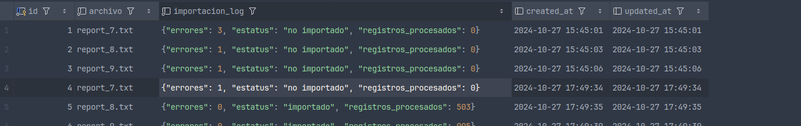
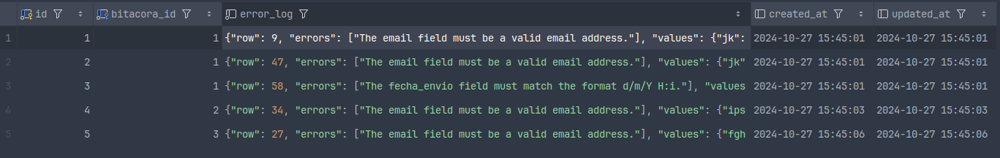
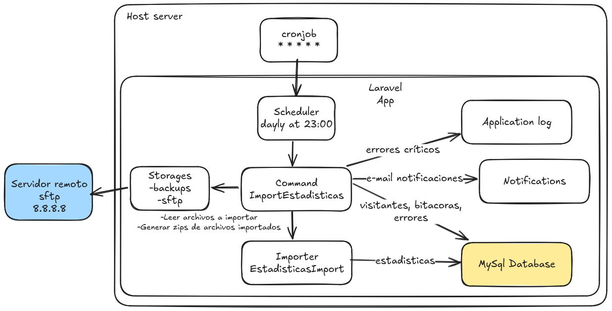

# VinkOs Prueba técnica

## Requerimientos

- Docker, Docker Compose

## Ambiente de desarrollo

Para levantar el proyecto con sus dependencias (servidor web, base de datos) se incluye un archivo `docker-compose.yml` en
el directorio raíz.

Utilizar [https://laravel.com/docs/11.x/sail](Laravel Sail) para levantar y correr el proyecto de manera más sencilla en modo local:
- Generar las imágenes y levantar los contenedor: `./vendor/bin/sail up`
  - Al levantar el ambiente de desarrollo por primera vez, ejecutar `./vendor/bin/sail artisan migrate` para generar las tablas en la base de datos
- Detener contendores `./vendor/bin/sail stop`
- Ejecutar comandos Artisan, por ejemplo: `./vendor/bin/sail artisan vinkos-pt:import-estadisticas`
- Consultar documentación de Laravel Sail para más información sobre la herramienta

## Componentes principales

- **Scheduler** (`routes/console.php`). Tarea registrada para programar la ejecución del comando `vinkos-pt:import-visitantes` diariamente 
a una hora específica. Para correr el scheduler en producción es necesario tener un cronjob configurado 
(ejemplo: `* * * * * cd /path-to-your-project && php artisan schedule:run >> /dev/null 2>&1`), como se indica en la documentación:
  (https://laravel.com/docs/11.x/scheduling#running-the-scheduler)[https://laravel.com/docs/11.x/scheduling#running-the-scheduler]
- **Comando ImportEstadisticas** (`app/Console/Commands/ImportEstadisticas.php`). Orquesta el proceso de ubicación y carga de los archivos 
del repositorio fuente a la base de datos. Este comando es ejecutado por el componente Scheduler según la periodicidad establecida 
(en este caso, diariamente). Más sobre [https://laravel.com/docs/11.x/artisan](creación y ejecución de comandos Artisan).
- **Importador EstadisticasImport** (`app/Imports/EstadisticasImport.php`). Importa un archivo aplicando primero las reglas de validación 
y transformaciones definidas en la clase. Más sobre [https://docs.laravel-excel.com/3.1/imports/](importaciones de archivos con Laravel Excel). 
*Este componente también ofrece la funcionalidad para procesar importaciones en colas en caso de que sea necesario por una gran cantidad de datos* 
- **Repositorios de almacenamiento *Storage***. Los storage (discs) son abstracciones que permiten cambiar dinámicamente las ubicaciones de los directorios
  (ver `config/filesystems.php`). Para este proyecto se han creado los siguientes:
    - `imports`: Apunta a una ubicación de prueba local con archivos .txt a importar, usado específicamente para pruebas del importador durante el desarrollo
    - `sftp`: Apunta a la ubicación SFTP de los archivos en producción con archivos .txt a importar (requiere instalar la librería `league/flysystem-sftp-v3`, ver el archivo `composer.json` de este proyecto)
    - `backups`: Apunta a la ubicación en donde se guardan los zip de los archivos importados
- **Base de datos**. El proyecto está configurado (ver archivo `.env`) para funcionar con una base de datos MySql y su estructura se genera mediante migraciones de Laravel (ver `database/migrations`). 
Las tablas principales requeridas por la importación son:
  - `estadisticas`: Contiene los renglones importados de archivos .txt
  - `visitantes`: Contiene información y totales acumulados por visitante
  - `bitacoras`: Contiene información sobre los archivos importados, ejemplo: 
  - `errores` Contiene información sobre los errores generados en cada importación de la bitácora, ejemplo: 
- **Notificaciones**. Para notificar sobre eventos ocurridos durante las importaciones via E-mail (aunque es posible configurarlo para otros canales) 
durante la importación se utiliza el componente (https://laravel.com/docs/11.x/notifications#mail-notifications)[Mail Notifications] 
Ver carpeta `app/Notifications` con las notificaciones creadas para este proyecto 
- **Log del sistema**. Los errores críticos a nivel general que ocurran durante el proceso de importanción se registran también por default
  en el log de la aplicación (`storage/logs/laravel.log`)

## Descripción del proceso de importación

Punto de entrada del proceso de importación (ver `app/Console/Commands/ImportEstadisticas.php`).

1. Se obtienen las rutas de los archivos a importar del repositorio origen considerando el
   formato de nombre `report_+consecutivo+.txt`
2. Se procesan la importación de los archivos encontrados. Para cada archivo a importar:
    - Se genera un error si el archivo no tiene el formato adecuado (CSV) al intentar leerlo
    - El importador (ver `app/Imports/EstadisticasImport.php`) aplica primero las reglas de formato CSV y
      de validación, si no se cumplen, se generan errores
      y se detiene la importación del archivo para continuar con el siguiente. En caso de un error inesperado se
      genera una entrada en la lista de errores del archivo y se intenta procesar el siguiente archivo
    - El importador genera una entrada por cada renglón en la tabla `estadisticas`, para mayor eficiencia
      en lotes de 1000 registros
    - Una vez importados los renglones a la tabla de `estadisticas`, se generan los registros y totales en la
      tabla de `visitantes`. Si el correo no se encuentra registrado, se crea un nuevo registro; si existe, se
      actualizan `fecha_ultima_visita` y totales de visitas. La actualización/creación (upsert) se realiza en lotes
    - Se genera una entrada en la bitácora (tabla bitacoras) con el resultado de la importación y los errores encontrados
3. Al terminar la importación de los archivos, se genera un zip y se guarda en el storage `backups`
4. Si el zip fue generado con éxito, se eliminan los archivos importados del directorio origen
